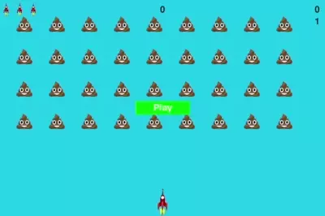

# Alien Invaders

A simple, fun project written for the purposes of ramping-up
with Python and showing new programmers an entertaining
romp through several core concepts. 

## Working with this Project
- Install Python >= 3.9
- Fetch contents of this project:
  - `git init`
  - `git pull https://github.com/jhaslam/alien_invaders.git`
- Fetch this project's dependency closure:
  - `python -m venv project_env`
  - `source ./project_env/Scripts/activate`
  - `python -m pip install -r requirements.txt` 

## Running the game
- From this project's directory, run:  
  `python alien-invaders.py`

## Controls
- Arrow keys to move
- Spacebar to shoot / start game
- Q to exit at any time
